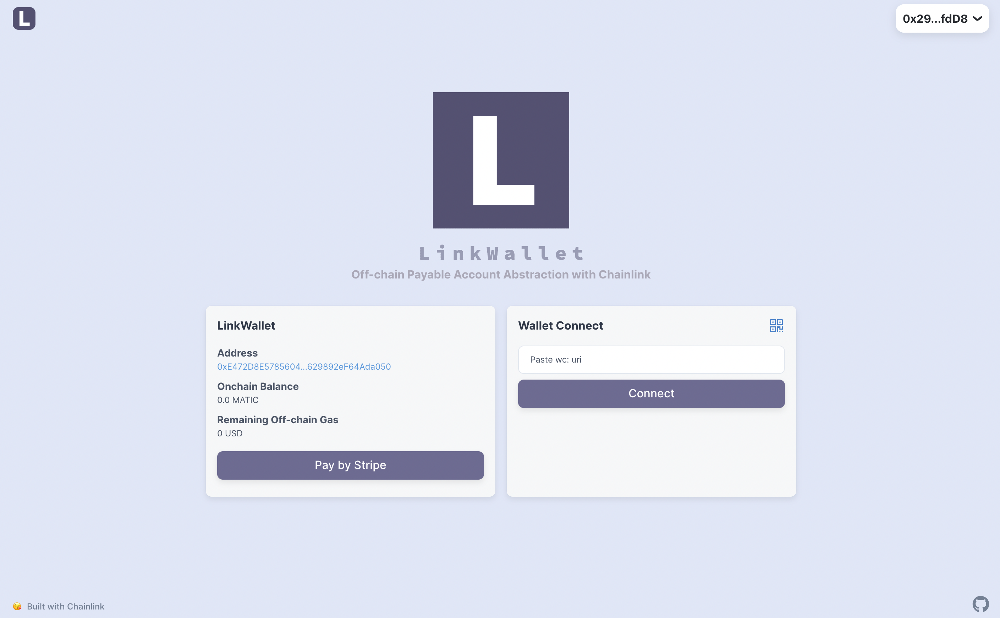
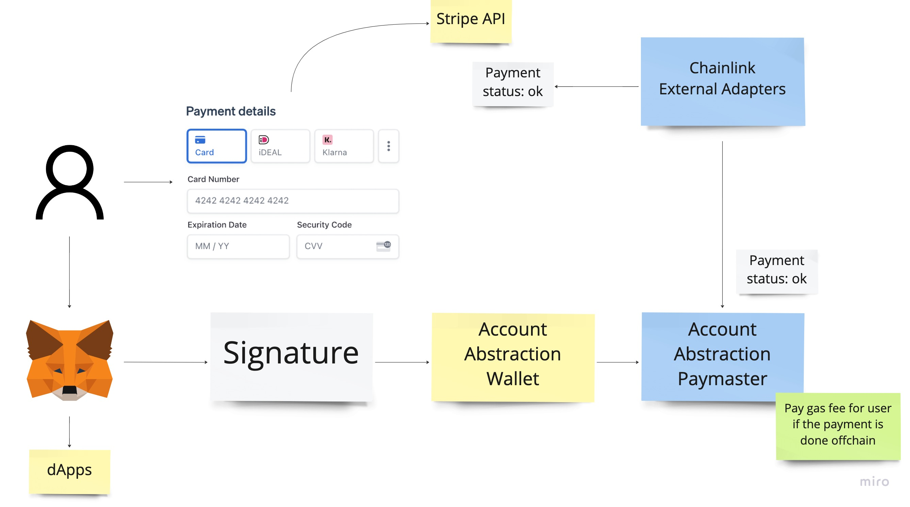

# Link Wallet

Account Abstraction Wallet with Offchain Gas Fee Subscription by Chainlink



## Submission

This is for [Chainlink 2022 Fall Hackathon](https://chain.link/hackathon)

### Demo Video

https://youtu.be/Ts63_YvXflQ

### Live App

https://link-wallet.vercel.app/

- this requires running a bundler in local

## User Benefits

- Users can pay the gas fee by an off-chain subscription
- It enables users to skip "bridge token from the other chain" or "send token from the central exchange", which is the first obstacle for users to start using a blockchain-based app
- It brings excellent onboarding, especially for the new user

## How it works



- The blue part is the main implementation of the hackathon
- Payment status is integrated securely with [Chainlink External Adapters](https://docs.chain.link/chainlink-nodes/external-adapters/external-adapters)
- Verification is implemented in an Account Abstraction way which brings better flexibility than the normal meta transaction

Implementation details are the followings.

### Chainlink Integration

- To integrate stripe payment status to the Polygon Mumbai
- The Main reference of the integration
  - https://docs.chain.link/chainlink-nodes/external-adapters/external-adapters

### Paymaster

- To pay the gas fee for users after verifying the stripe payment status
- The main reference of the integration
  - https://github.com/eth-infinitism/account-abstraction/blob/develop/contracts/samples/DepositPaymaster.sol

### Stripe Integration

- To manage user payment for the gas fee
- The Main reference of the integration
  - https://github.com/thirdweb-example/thirdweb-stripe

## Deployed Contract

### ChainlinkStripePaymaster

https://mumbai.polygonscan.com/address/0xbb0447c7194fb0e99213ad140d0dff4c82fbb9ca#code

- This is the main development

#### Deposit

https://mumbai.polygonscan.com/tx/0x13104da61528f0364735726a5d1a154b7f7582e01f6cb409a1e49dddd38c9709

- Deposit 1 Matic to the paymaster, this is used with gas payment for paid users

#### Stake

https://mumbai.polygonscan.com/tx/0x19726ad9fa4686f780001ef3fe614e93a3059d1308bf2e48647f4946d4241e7d

- Stake 1 Matic to the paymaster, this is used with gas payment for paid users

#### Link Deposit

https://mumbai.polygonscan.com/tx/0x360d68d77451681ac75a063145d83f3c2e0bbba1a9ef0ae5f21ae3612a150a8f

- Deposit 5 Link to the paymaster, this is used with Chainlink request

### EntryPoint

https://mumbai.polygonscan.com/address/0xf317c52db727f9d8a3ac04304cb34a297bffef9a#code

- This is required for the Account Abstraction setup
- This EntryPoint handles the user request

### WalletFactory

https://mumbai.polygonscan.com/address/0x5352d8704b9a251d46aa4674e3215fc6d7baa80a#code

- This is required for the Account Abstraction setup
- This wallet factory makes the Account Abstraction wallet address ounterfactual by create2

## Other Information

### Stripe Test

https://stripe.com/docs/testing

## Development

- must have Metamask
- must run with an internet connection

```
git submodule update --init --recursive
yarn
yarn dev
```
