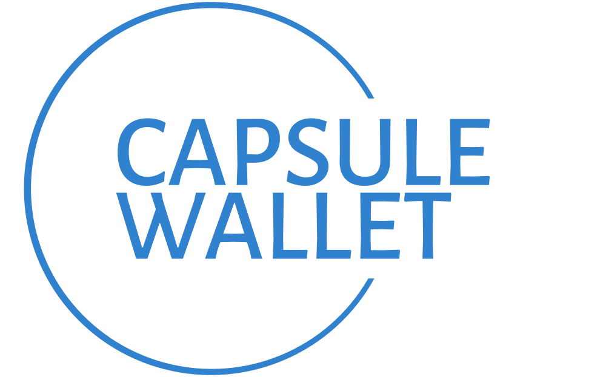
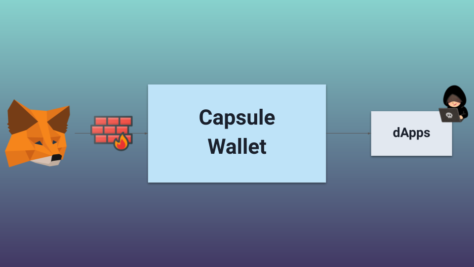
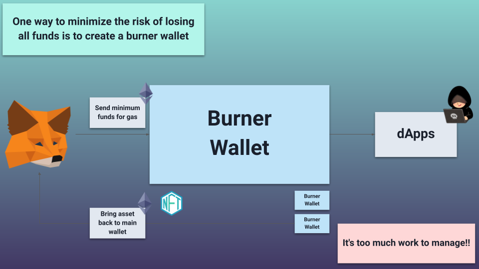
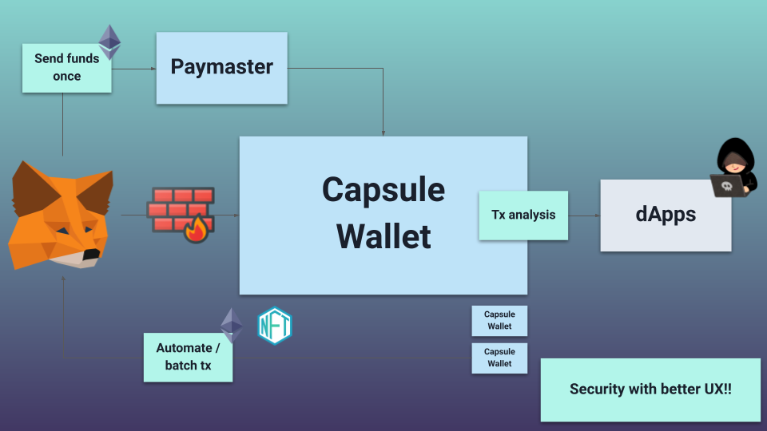

# Capsule Wallet

## Description

We are excited to introduce the Capsule Wallet, a secure wallet manager powered by Account Abstraction and Burner Wallet.

The Capsule Wallet utilizes Burner Wallet to minimize security risks from hacking and provides a better UX for users by Account Abstraction.

With the Capsule Wallet, you can manage your accounts with ease and confidence, knowing that your asset is safe and secure. So why wait? Get the Capsule Wallet today!

## How it works

### Security Model

## Deployed Contracts

### CapsuleWalletDeployer

https://goerli.etherscan.io/address/0xea6b837f02f6f6f426d9a145d583eedf6ee9e959#code

### NFTDrop for Test

https://goerli.etherscan.io/address/0x2280c6db79ce3bc7eee56934fd2d8a5ba6b10fda#writeContract

### CapsuleWallet

- This contract is deployed via the above deployer in the application

## Pitch Deck

https://docs.google.com/presentation/d/1UVNxJmL83hINHz8diepNhaDMs_nqySxBBKR3o0Od2cI/edit?usp=sharing

## Presentation Video

TBD

## Development

### Design

- Should utilize [Chakra UI Pro](https://pro.chakra-ui.com/)

- Should utilize [Chakra UI blue theme](https://chakra-ui.com/docs/styled-system/theme#blue)

- Should utilize images with #3182CE (equivalent to blue.500 in Chakra UI) in [unDraw](https://undraw.co/)
