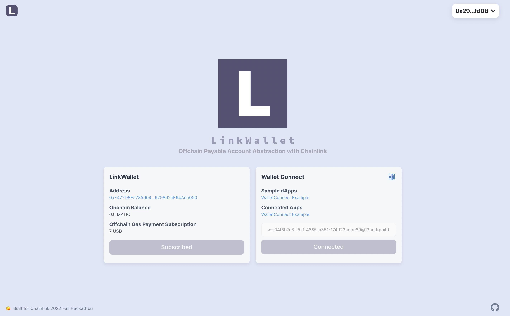

# Link Wallet

Off-chain Payment Account Abstraction Wallet with Chainlink



## Submission

This is for [Chainlink 2022 Fall Hackathon](https://chain.link/hackathon)

### Demo Video

TBD

### Live App

TBD

## User Benefits

- User can pay gas-fee Off-chain when start using new chain, in this hackathon, it is Polygon
- It enables users to skip "bridge token from the other chain" or "send token from the central exchange", which is first obstacle for users to start using blockchain based app
- It brings very good on-boarding especially for the new user

## How it works


- Blue part is the main implementation of hackathon
- Payment status is integrated securly with [Chainlink External Adapters](https://docs.chain.link/chainlink-nodes/external-adapters/external-adapters)
- Verification is implemented in Account Abstraction way which brings better flexibility than usual meta transaction

Implementation details are the followings.

### Chainlink Integration

- To integrate stripe payment status to the Polygon Mumbai
- The Main reference of the integration
  - https://docs.chain.link/chainlink-nodes/external-adapters/external-adapters

### Pyamaster

- To pay the gas fee for users after checking the stripe payment status
- The main reference of the integration
  - https://github.com/eth-infinitism/account-abstraction/blob/develop/contracts/samples/DepositPaymaster.sol

### Stripe Integration

- To manage user payment for the gas fee
- The Main reference of the integration
  - https://github.com/thirdweb-example/thirdweb-stripe

## Development

- must run with an internet connection

```
git submodule update --init --recursive
yarn
yarn dev
```
